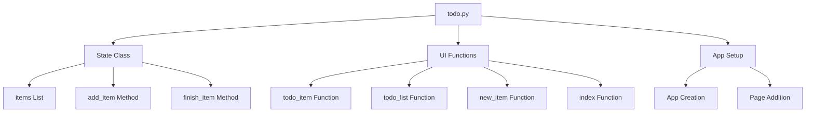
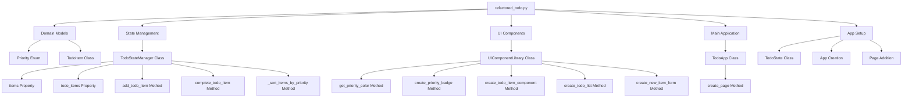
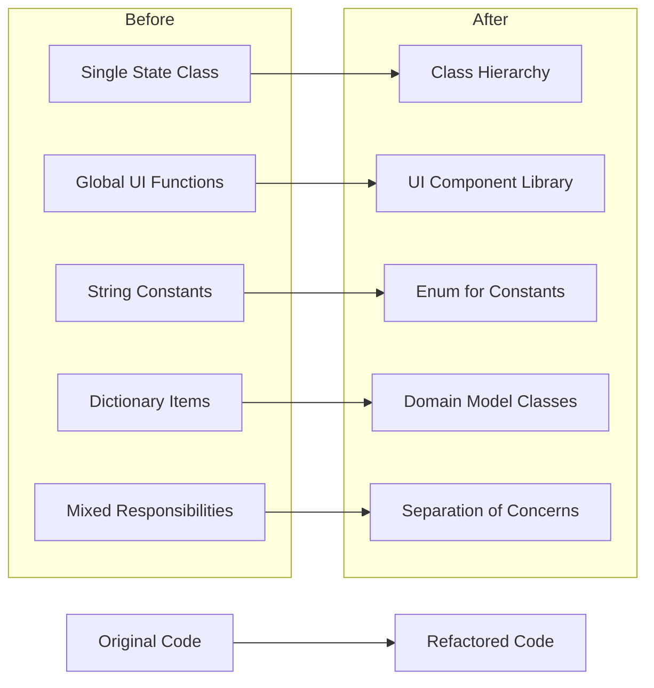

# Todo App Refactoring Diagram

This document provides visual representations of the refactoring process, showing the before and after structure of the Todo application.

## Before Refactoring: Code Structure



## After Refactoring: Code Structure



## Refactoring Transformation



## Key Refactoring Types

```mermaid
graph TD
    A[Refactoring Types] --> B[Renaming Entities]
    A --> C[Extracting Functions]
    A --> D[Creating Base Classes]
    A --> E[Moving Functions]
    A --> F[Other Refactorings]
    
    B --> B1[State → TodoStateManager]
    B --> B2[add_item → add_todo_item]
    B --> B3[finish_item → complete_todo_item]
    
    C --> C1[Extract get_priority_color]
    C --> C2[Extract create_priority_badge]
    C --> C3[Extract validation logic]
    
    D --> D1[Create Priority Enum]
    D --> D2[Create TodoItem Class]
    D --> D3[Create UIComponentLibrary]
    
    E --> E1[UI Functions → UIComponentLibrary]
    E --> E2[State Logic → TodoStateManager]
    E --> E3[App Structure → TodoApp]
    
    F --> F1[Enhanced Type Hints]
    F --> F2[Data Validation]
    F --> F3[Sorting Implementation]
    F --> F4[Dependency Injection]
```



## Benefits of Refactoring

```mermaid
graph TD
    A[Benefits] --> B[Improved Maintainability]
    A --> C[Enhanced Type Safety]
    A --> D[Better Organization]
    A --> E[Increased Reusability]
    A --> F[Future-Proofing]
    
    B --> B1[Single Responsibility Principle]
    B --> B2[Better Documentation]
    
    C --> C1[Enum for Constants]
    C --> C2[Return Type Annotations]
    
    D --> D1[Logical Class Structure]
    D --> D2[Separation of Concerns]
    
    E --> E1[Extracted Components]
    E --> E2[Utility Functions]
    
    F --> F1[Extensible Architecture]
    F --> F2[Modular Design]
