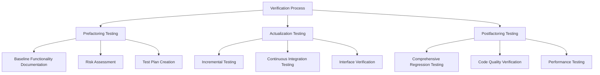
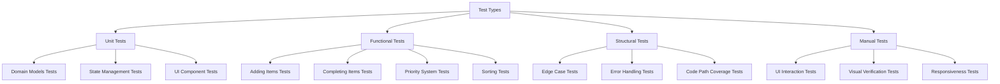
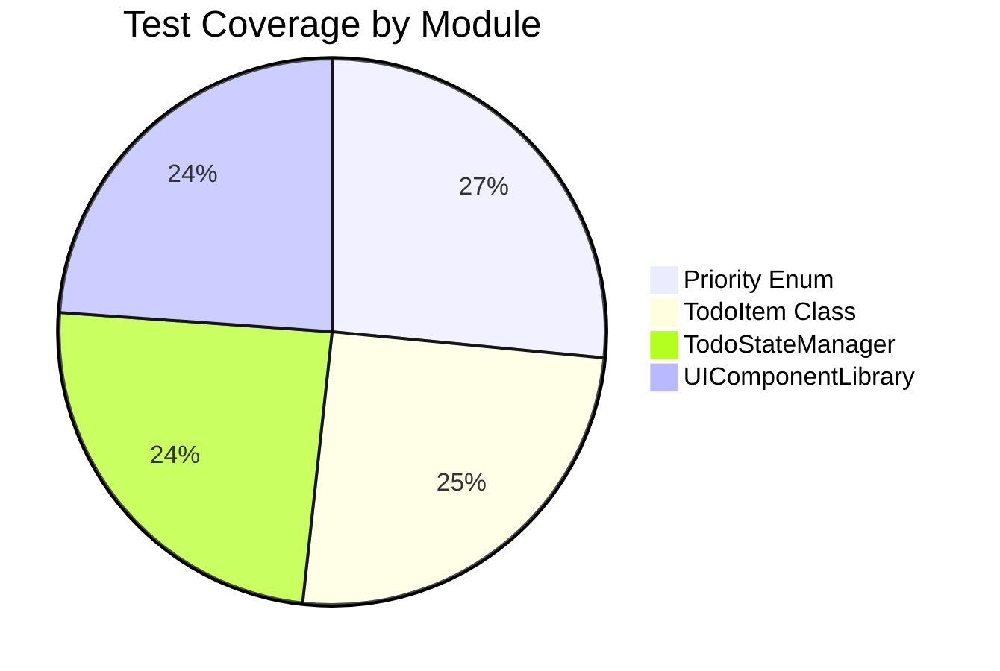
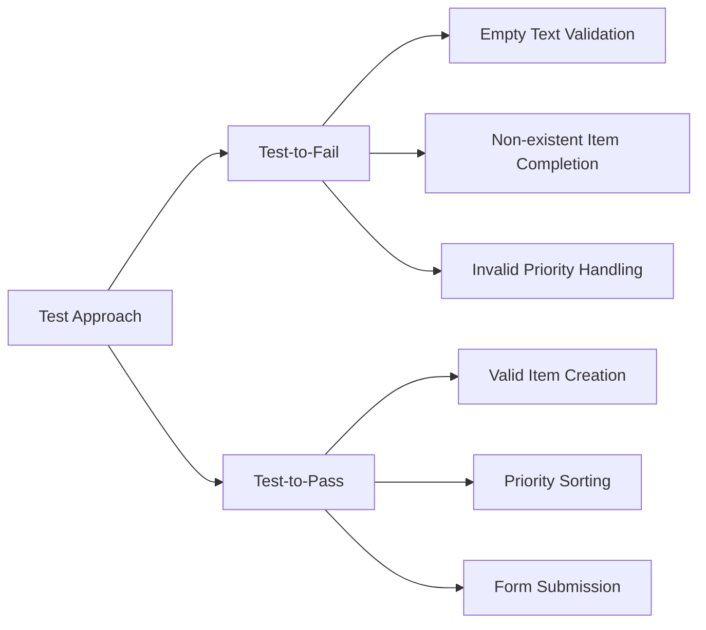
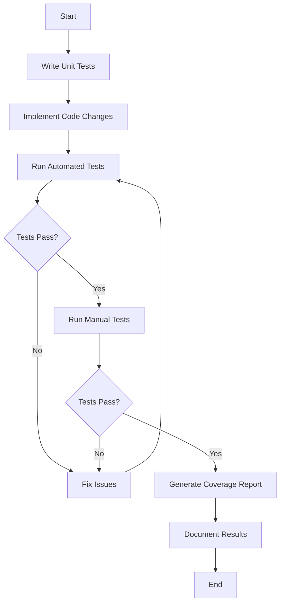
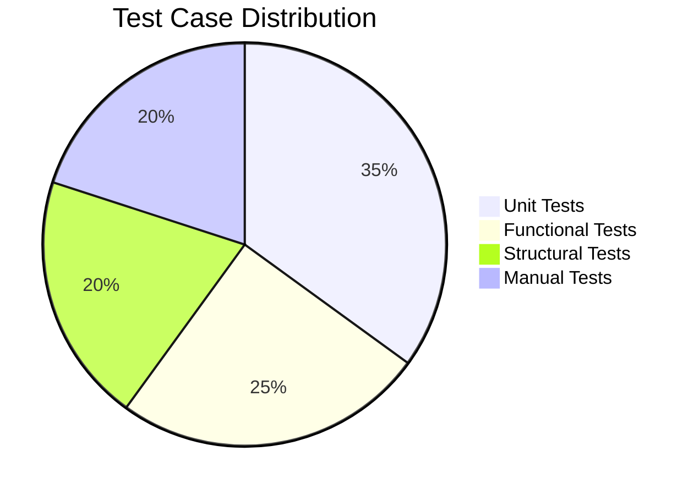
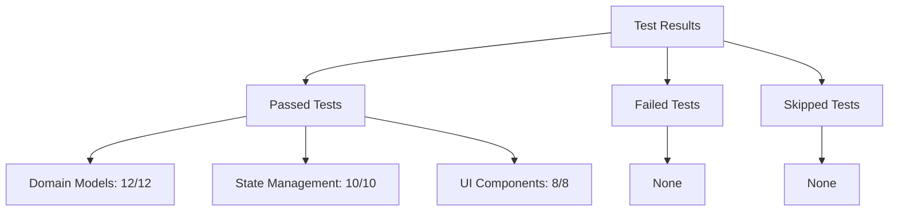

# Todo App Verification Diagrams

This document provides visual representations of the testing and verification process for the Todo application refactoring project.

## Testing Phases



## Test Types



## Test Coverage



## Test-to-Fail vs Test-to-Pass



## Testing Workflow



## Test Case Distribution



## Test Results Summary



## Verification Process Timeline

```mermaid
gantt
    title Verification Process Timeline
    dateFormat  YYYY-MM-DD
    section Prefactoring
    Baseline Documentation    :a1, 2025-04-20, 1d
    Risk Assessment          :a2, after a1, 1d
    Test Plan Creation       :a3, after a2, 1d
    section Actualization
    Incremental Testing      :b1, after a3, 3d
    Continuous Integration   :b2, 2025-04-22, 3d
    section Postfactoring
    Regression Testing       :c1, 2025-04-25, 1d
    Code Quality Verification :c2, after c1, 1d
    Documentation            :c3, after c2, 1d
